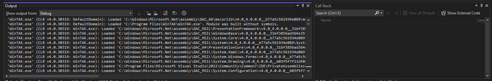

This page describes how to log information from a WinTAK plugin. Developing a WinTAK plugin requires sometimes to have an overview of what the plugin currently doing. There are several ways to print information from the current implementation. From C# basic to WinTAK Logger.

### Contents

- [Visual Studio Output](#visual-studio-output)
- [WinTAK Framework Logs](#wintak-framework-logs)
    - [WinTAK Logger](#wintak-logger)
    - [WinTAK Log](#wintak-log)
___

<br>

## Visual Studio Output

On of the first entrypoint to debug code is to use one of the most common C# basic method to display it into Visual Studio Code :

```csharp
    System.Diagnostics.Debug.WriteLine("Hello World!");
```



This method provides an output log into Visual Studio debug output window.

## WinTAK Framework Logs

As explained in the [WinTAK Quick Setup](../setup/quick_setup.md/#wintak-files), WinTAK have a `%APPDATA%/WinTAK/Logs` where logging information is recorded when WinTAK is running. The logging text file is also a result of the debug window in Visual Studio.

The `%APPDATA%/WinTAK/Logs` contains a series of pre-formatted files which are : ***{Log/Errors/Fatal}-WinTAK-yyyy-mm-dd.txt***

### WinTAK Logger

This section describe the ILogger interface which is defined in WinTak.Framework. This Interface provide the possibility to directly logging into the WinTak Logs folder.

```cs
    using WinTak.Framework;
    .. 
    public ILogger _logger;

    [ImportingConstructor]
    public THeFaboulousClassNameConstructor(ILogger logger)
    {
        _logger = logger;
        _logger.Debug("Log a Debug message!");
    }

    public void TheFaboulousMethod() {
        _logger.Debug("Log a Debug message!");
    }

```

The possibilities of ILogger are :

- `ILogger.Debug` for **DEBUG** with the possibility to extend `Exception`
- `ILogger.Error` for **ERROR** with the possibility to extend `Exception`
- `ILogger.Fatal` for **FATAL** with the possibility to extend `Exception`
- `ILogger.Info` for **INFO** with the possibility to extend `Exception`
- `ILogger.Warn` for **WARNING** with the possibility to extend `Exception`

### WinTAK Log

This section describe the Log Class which is the same as ATAK developer already use. This class :

```cs
    using MapEngine.Interop.Util;
    ..
    internal const string TAG = "TheFaboulousClassName"
    ..
    public void AnyMethod(string msg) {
        Log.d(TAG, "log a Debug message");
    } 

```
The possibilities of logs are :

- `Log.d` for **DEBUG** message with the possibility to extend `System::Exception`
- `Log.e` for **ERROR** message message with the possibility to extend `System::Exception`
- `Log.i` for **INFO** message message with the possibility to extend `System::Exception`
- `Log.w` for **WARNING** message message with the possibility to extend `System::Exception`
