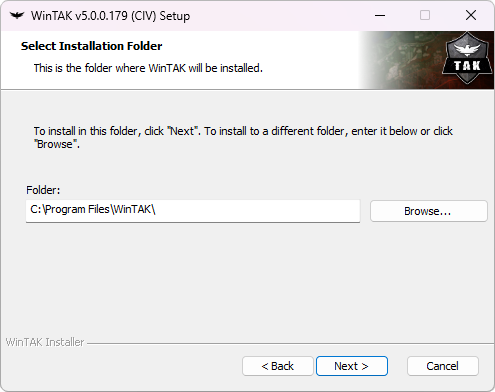
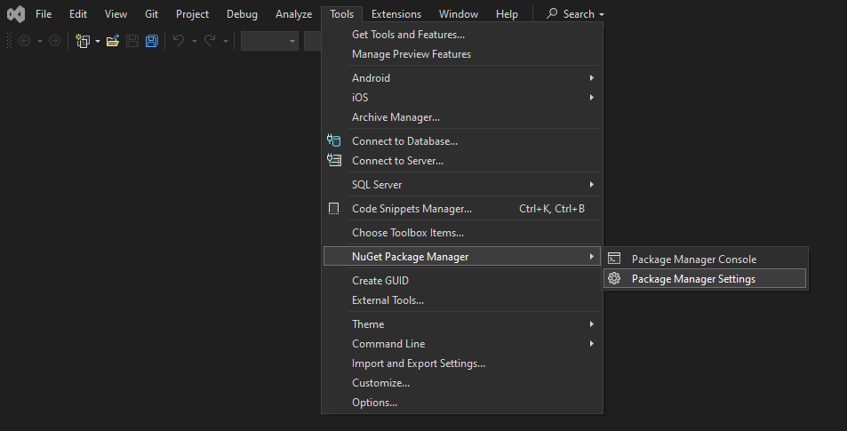

This section will focus on installing WinTAK Software Development Kit (SDK) and run as stand-alone application or through Microsoft Visual Studio IDE Community 2022.

<i>This guide is based on [Cale-Torino WinTAK SDK Install](https://github.com/Cale-Torino/WinTAK_SDK_Install)</i>

### Contents

- [Prerequisities](#prerequisities)
    - [System Requirements](#system-requirements)
    - [Development Tool Requirements](#development-tool-requirements)
    - [SDK Installation File](#sdk-installation-file)
    - [Others](#others)
- [Install WinTAK SDK](#install-wintak-sdk)
    - [Welcome to WinTAK Setup Wizard](#welcome-to-the-wintak-setup-wizard)
    - [Select installation folder](#select-installation-folder)
    - [Optional WinTAK Plugins to install](#optional-wintak-plugins-to-install)
    - [Ready to install / Installing WinTAK](#ready-to-install--installing-wintak)
    - [Completing the WinTAK Setup Wizard](#completing-the-wintak-setup-wizard)
- [Configure WinTAK SDK into MSVC](#configure-wintak-sdk-into-mvsc)
    - [Start Visual Studio](#start-mvsc)
    - [NuGet Package Manager](#nuget-package-manager)
    - [NuGet Package sources](#nuget-package-manager)
- [Install WinTAK VSIX](#install-wintak-vsix)

___

 

## Prerequisities

### System Requirements
- RAM : 8 ~ 16 GB recommended
- 64-bit Microsoft® Windows® 10 / 11
- GPU that support D3D9 and D3D11
- administrator right 
### SDK installation File
- WinTAK-A.b.c.ddd-civ-sdk-installer-x64.exe

### Development Tool Requirements
- Microsoft Visual Studio IDE Community 2022 installed. [Installation Guide](/visual_studio_setup/).
- .NET Framework 4.8.0 installed. [Download page](https://dotnet.microsoft.com/en-us/download/dotnet-framework/net48).
- WinTAK.Templates.visx (available on tak.gov)

### Others
- WinTAK SDK documentation available on tak.gov for newer version.
    - The documentation is generated with doxygen and provides an high overview of classes / methods / parameters.
    - There is no examples / code samples.
- Documentation resources from tak.gov
    - Some tips are provided by tak.gov and transcript in this website as support.

Here is the Developer Resources available on tak.gov :

<i>Screenshot 04/05/2024</i>

## Install WinTAK SDK
The installation of WinTAK SDK requires to have adminstrator right and privilege. A pop-up will appears with TAK CIV Logo and TPC for (TAK Product Center).

Follow the wizard to install WinTAK SDK.

### Welcome to the WinTAK Setup Wizard

Click next to continue.

### Select installation folder

Keep the default folder : `C:\Program Files\WinTAK`. This folder is important to correctly set up the WinTAK environment into Microsoft Visual Studio. Otherwise, ensure that all information above is correctly set with the custom path.

Click next to continue.

### Optional WinTAK Plugins to install
In the installation file, WinTAK SDK has some included plugins which can be set or not set. It is the choice of the user/developer to keep it into a development environment. You can decide to not include it. However if you encounter any issue during the development with plugin you can remove it later.

Click next to continue.

### Ready to install / Installing WinTAK

Click next to continue.

Wait until installation is finished and click next to continue.

### Completing the WinTAK Setup Wizard

Click finish to finalize the installation of WinTAK SDK and close the Setup Wizard. 

## Configure WinTAK SDK into MVSC

The WinTAK SDK folder provides NuGet packages `C:\Program Files\WinTAK\NuGet`. To be able to use it into MVSC, a configuration need to be made.

### Start MVSC

Start Microsoft Visual Studio and click continue without code.

### NuGet Package Manager

Select Tools > NuGet Package Manager > Package Manager Settings

### NuGet Package sources

In the Options menu :
1. Select NuGet Package Manager > <u>Package Sources</u>.
2. Click on the + button to add a <i>Package sources</i>.
    1. Choose the name you want for the WinTAK NuGet Package (ex. WinTAT).
    2. Source, browse to the NuGet folder in WinTAK or write the path directly : `C:\Program Files\WinTAK\NuGet`.
3. Close the Options menu.

## Install WinTAK VSIX
To be able to use the `.vsix` provided by tak.gov, you need just need to double click on the file and follow the installation wizard. After that, you will be able to see it in when you click on <b>Create a new project</b>.

In the Create a new project splash screen, do a research on WinTAK to find the WinTAK Plugin project.

Now you will be able to create plugin and using the WinTAK SDK locally. This part is explained in the next section.